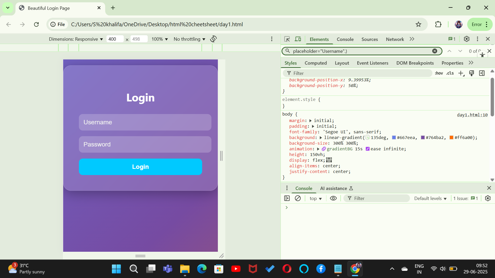

# task4-developer-tools-practice
This project demonstrates Chrome Developer Tools usage for inspecting and live-editing HTML &amp; CSS as part of Day 4 Front-End learning.
# ✅ Day 4 Task – Developer Tools Practice

This task demonstrates how to use **Chrome Developer Tools** to inspect elements, modify HTML/CSS live, and understand the structure of a webpage visually.

---

##  What I Practiced

- Opened Chrome DevTools (Elements tab)
- Inspected and edited HTML tags
- Modified background color and padding using the Styles panel
- Observed live changes in the design
- Practiced debugging visually

---

##  Learning Outcome

- Understood how real-time code debugging works in the browser
- Learned the importance of browser inspection for layout/design fixes
- Improved confidence in using browser tools like a front-end developer

---

## 📸 Screenshot of My Work

---

## Tools Used

- HTML & CSS
- Chrome Developer Tools
- Windows 11 + Edge/Chrome Browser

---

## Folder Structure
 index.html
 Screenshot2.png
 README.md

---

 Tip: Right-click → Inspect → Explore Elements and try changing things like colors, font size, etc. Live!

